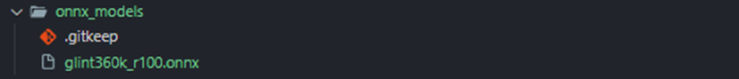
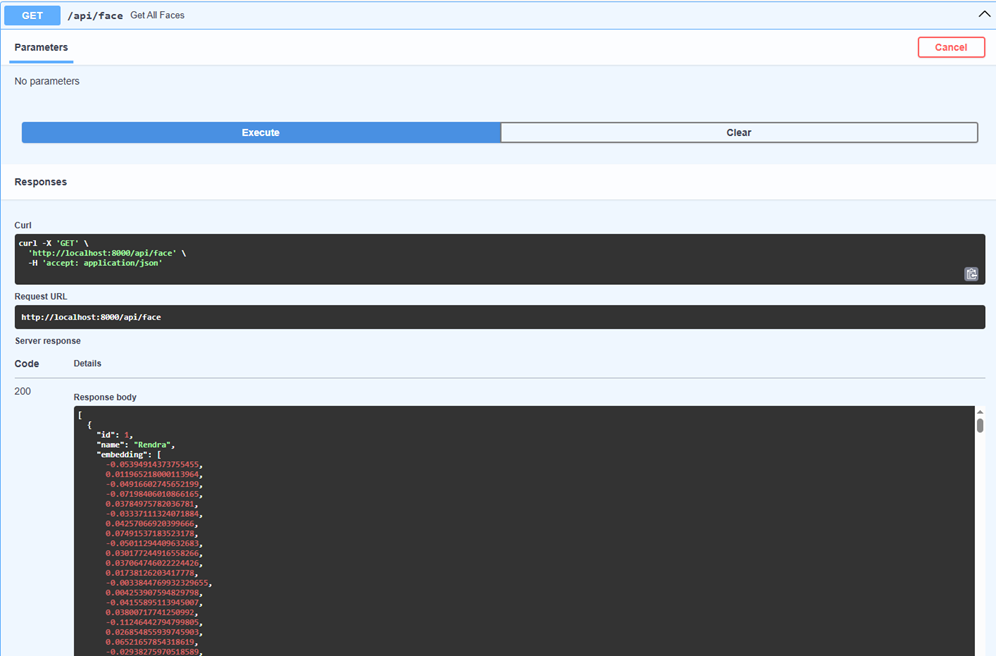
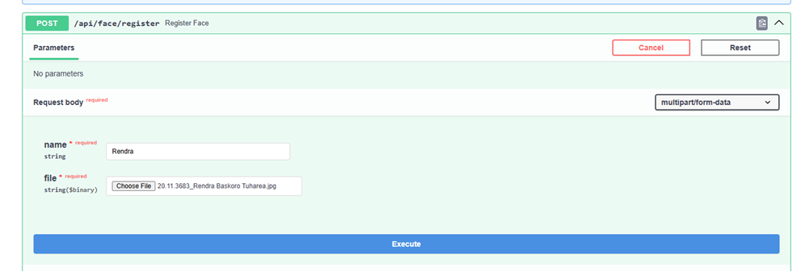
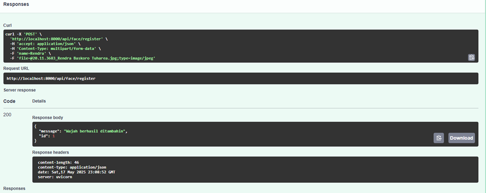
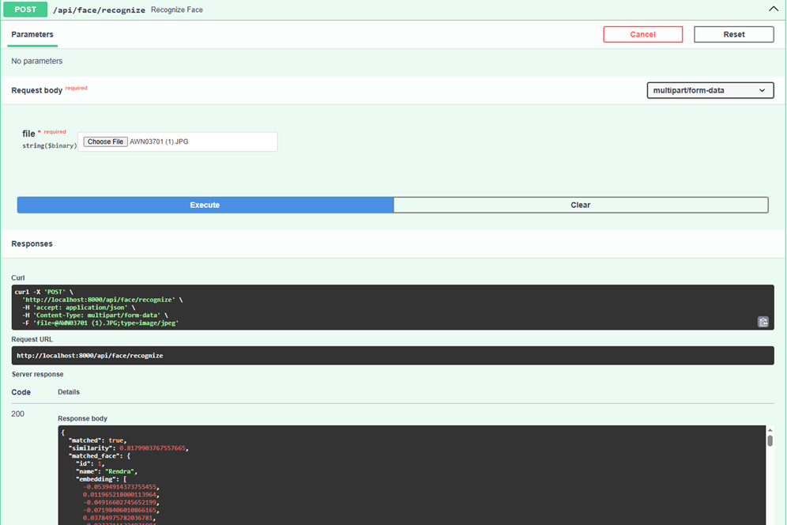
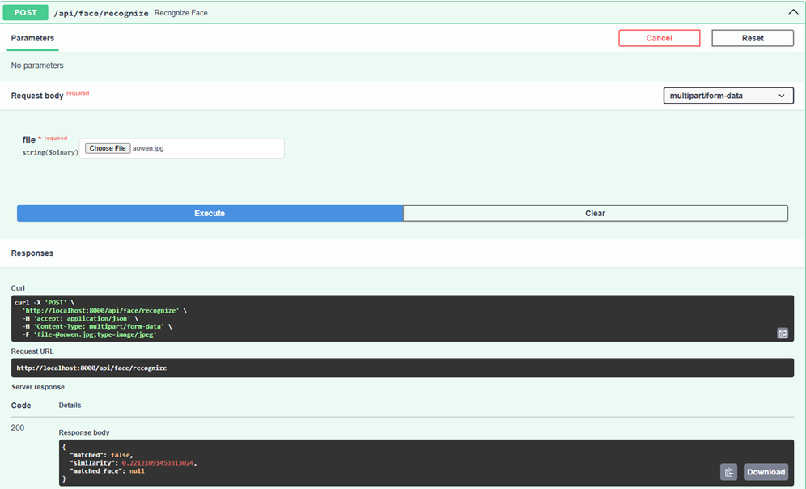
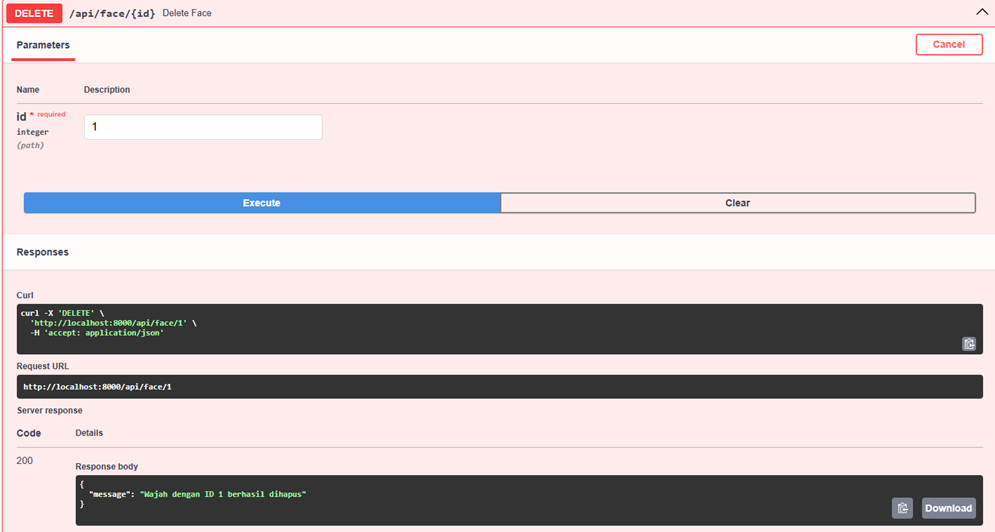

# Face Recognition API

Sistem Face Recognition ini dibangun menggunakan **FastAPI**, **PostgreSQL**, dan **ONNX InsightFace (Glint360k R100)**. Sistem ini mampu melakukan deteksi wajah, ekstraksi fitur (embedding), pencocokan wajah, serta menyimpan/mengelola data wajah yang sudah dikenali.

---

## 🛠 Teknologi yang Digunakan

* **Python 3.10**
* **FastAPI**
* **SQLAlchemy**
* **PostgreSQL (via Docker)**
* **InsightFace (buffalo\_l)**
* **ONNX Runtime**
* **Docker + Docker Compose**

---

## 📦 Struktur Folder

```
face_recognition_api/
├── app/
│   ├── api/
│   │   └── face.py               # Endpoint API utama
│   ├── core/
│   │   ├── config.py             # Konfigurasi & utilitas
│   │   └── utils.py              # Fungsi tambahan (resize gambar, base64, dll)
│   ├── models/
│   │   └── face_model.py         # Model SQLAlchemy untuk table faces
│   ├── schemas/
│   │   └── face_schema.py        # Schema Pydantic untuk request & response
│   ├── services/
│   │   └── face_service.py       # Logic untuk deteksi & embedding wajah
│   ├── main.py                   # Entry point FastAPI
│
├── onnx_models/                 # Folder model ONNX (kosong, isi manual)
│   └── glint360k_r100.onnx       
├── .env                          # Konfigurasi environment
├── requirements.txt             # Semua dependencies
├── Dockerfile                   # Instruksi build image API
├── docker-compose.yaml          # Menjalankan API + DB sekaligus
```

---

## 🚀 Cara Menjalankan

### 1. **Clone Repositori**

```bash
https://github.com/RndraThr/face_recognition_api.git
cd face-recognition-api
```

### 2. **Siapkan Model ONNX**

Karena GitHub tidak mendukung file besar (>100MB), file model tidak disertakan. Silakan:

* Download manual model dari [Google Drive (glint360k\_r100.onnx)](https://drive.google.com/file/d/1SU8rLHaQvygJbq5BVdY4a5X_-HO_k3Ur/view?usp=sharing)
* Simpan ke folder:

```bash
onnx_models/glint360k_r100.onnx
```

> Pastikan file berada di path yang tepat agar tidak error saat load.


### 3. **Atur File `.env`**

```env
DATABASE_URL=postgresql://postgres:admin@db:5432/facerecognition
THRESHOLD=0.4
```

### 4. **Build & Jalankan Docker**

```bash
docker-compose up --build
```

Akses dokumentasi API: [http://localhost:8000/docs](http://localhost:8000/docs)

---

## 📌 Endpoint API

### 1. **\[GET] /api/face**

Mengambil semua data wajah di database.
**Response**:

```json
[
  {
    "id": 1,
    "name": "John Doe",
    "embedding": [...],
    "created_at": "2025-05-17T08:00:00"
  }
]
```

---

### 2. **\[POST] /api/face/register**

Mendaftarkan wajah baru ke database.
**Form-Data Input**:

* `name`: Nama orang
* `file`: Gambar wajah

**Response**:

```json
{
  "message": "Wajah berhasil ditambahin",
  "id": 2
}
```

**Error**: Wajah tidak terdeteksi → 400 Bad Request



---

### 3. **\[POST] /api/face/recognize**

Mengenali wajah dari gambar dengan membandingkan ke semua embedding.
**Input**: `file` (gambar wajah)

**Response jika cocok**:

```json
{
  "matched": true,
  "similarity": 0.87,
  "matched_face": {
    "id": 2,
    "name": "John Doe",
    "embedding": [...],
    "created_at": "2025-05-17T08:00:00"
  }
}
```


**Response jika tidak cocok**:
```json
{
  "matched": false,
  "similarity": 0.15,
  "matched_face": null
}
```

---

### 4. **\[DELETE] /api/face/{id}**

Menghapus wajah berdasarkan ID.
**Response jika berhasil**:

```json
{
  "message": "Wajah dengan ID 2 berhasil dihapus"
}
```

**Jika ID tidak ditemukan**:

```json
{
  "detail": "Wajah nggak ditemukan"
}
```

---

## 🧠 Catatan Teknis

* **Face Detection**: InsightFace (`buffalo_l`) + fallback HaarCascade
* **Embedding**: model `glint360k_r100.onnx` via ONNX Runtime
* **Similarity Threshold**: dapat dikonfigurasi via `.env` (`THRESHOLD=0.4`)
* **Database**: tersimpan di volume Docker (`postgres_data`)

---

## 🐳 Docker Commands

```bash
# Jalankan dan build ulang
$ docker-compose up --build

# Jalankan di background
$ docker-compose up -d

# Hentikan semua container
$ docker-compose down
```